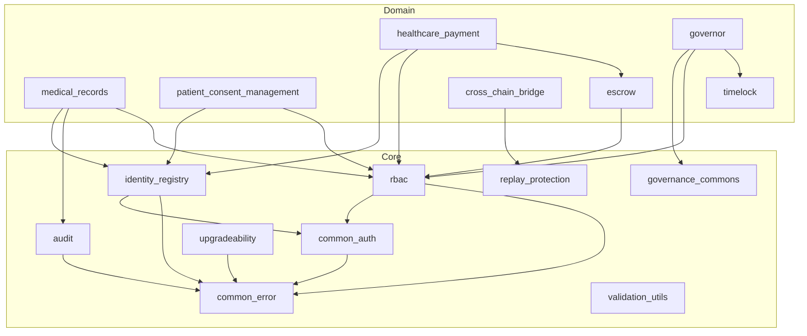

# Contract Dependency Graph and Ownership Model

This document establishes the workspace-wide contract dependency graph and ownership model for the Uzima-Contracts portfolio.

## Overview

The Uzima-Contracts workspace contains a large number of Soroban smart contracts organised by domain. This document:

1. Defines the dependency graph between contracts
2. Assigns ownership tiers (Core / Domain / Support / Tooling)
3. Documents blast radius for changes to shared contracts
4. Provides a change-impact reference for maintainers and reviewers

---

## Ownership Tiers

| Tier | Description | Review requirement |
|------|-------------|-------------------|
| **Core** | Shared infrastructure used by many contracts | 2 maintainer approvals + security review |
| **Domain** | Business-logic contracts for a specific healthcare domain | 1 maintainer approval |
| **Support** | Testing, tooling, analytics helpers | 1 contributor approval |
| **Tooling** | CI/CD helpers, scripts, optimizer | Standard review |

---

## Core Contracts (shared infrastructure)

| Contract | Tier | Owned by | Depends on |
|----------|------|----------|------------|
| `common_error` | Core | @maintainers | — |
| `common_auth` | Core | @maintainers | `common_error` |
| `rbac` | Core | @maintainers | `common_error`, `common_auth` |
| `audit` | Core | @maintainers | `common_error` |
| `identity_registry` | Core | @maintainers | `common_error`, `common_auth` |
| `upgradeability` | Core | @maintainers | `common_error` |
| `libs/governance_commons` | Core | @maintainers | — |
| `libs/replay_protection` | Core | @maintainers | — |
| `libs/validation_utils` | Core | @maintainers | — |

---

## Domain Contracts

### Medical Records Domain

| Contract | Tier | Depends on |
|----------|------|------------|
| `medical_records` | Domain | `rbac`, `audit`, `identity_registry`, `common_error` |
| `patient_consent_management` | Domain | `rbac`, `identity_registry`, `common_error` |
| `medical_record_search` | Domain | `medical_records`, `rbac` |
| `medical_record_hash_registry` | Domain | `common_error` |
| `medical_record_backup` | Domain | `medical_records`, `common_error` |
| `medical_consent_nft` | Domain | `patient_consent_management`, `rbac` |
| `patient_portal` | Domain | `medical_records`, `patient_consent_management` |

### Identity & Access Domain

| Contract | Tier | Depends on |
|----------|------|------------|
| `access_control` | Domain | `rbac`, `common_auth` |
| `credential_registry` | Domain | `identity_registry`, `common_error` |
| `mfa` | Domain | `identity_registry`, `common_error` |
| `zkp_registry` | Domain | `common_error` |
| `zk_verifier` | Domain | `common_error` |
| `fido2_authenticator` | Domain | `identity_registry`, `common_error` |
| `crypto_registry` | Domain | `common_error` |

### Payment & Escrow Domain

| Contract | Tier | Depends on |
|----------|------|------------|
| `escrow` | Domain | `rbac`, `common_error` |
| `healthcare_payment` | Domain | `escrow`, `rbac`, `identity_registry` |
| `appointment_booking_escrow` | Domain | `escrow`, `identity_registry` |
| `payment_router` | Domain | `healthcare_payment`, `common_error` |
| `treasury_controller` | Domain | `rbac`, `governance_commons` |
| `token_sale` | Domain | `rbac`, `common_error` |
| `sut_token` | Domain | `common_error` |

### Governance Domain

| Contract | Tier | Depends on |
|----------|------|------------|
| `governor` | Domain | `timelock`, `rbac`, `governance_commons` |
| `timelock` | Domain | `governance_commons`, `common_error` |
| `upgrade_manager` | Domain | `upgradeability`, `rbac` |

### Cross-Chain Domain

| Contract | Tier | Depends on |
|----------|------|------------|
| `cross_chain_bridge` | Domain | `replay_protection`, `common_error` |
| `cross_chain_access` | Domain | `cross_chain_bridge`, `identity_registry` |
| `cross_chain_identity` | Domain | `cross_chain_bridge`, `identity_registry` |
| `cross_chain_enhancements` | Domain | `cross_chain_bridge` |
| `sync_manager` | Domain | `cross_chain_bridge`, `common_error` |

### Analytics & AI Domain

| Contract | Tier | Depends on |
|----------|------|------------|
| `ai_analytics` | Domain | `rbac`, `common_error` |
| `anomaly_detection` | Domain | `audit`, `common_error` |
| `anomaly_detector` | Domain | `ai_analytics`, `common_error` |
| `predictive_analytics` | Domain | `common_error` |
| `contract_usage_analytics` | Domain | `audit`, `common_error` |

### Healthcare Operations Domain

| Contract | Tier | Depends on |
|----------|------|------------|
| `provider_directory` | Domain | `identity_registry`, `rbac` |
| `health_data_access_logging` | Domain | `audit`, `rbac`, `identity_registry` |
| `healthcare_compliance` | Domain | `rbac`, `audit` |
| `healthcare_compliance_automation` | Domain | `healthcare_compliance` |
| `regulatory_compliance` | Domain | `common_error` |
| `notification_system` | Domain | `common_error` |
| `dispute_resolution` | Domain | `rbac`, `escrow`, `common_error` |
| `emergency_access_override` | Domain | `rbac`, `audit`, `common_error` |

---

## Support Contracts

| Contract | Tier | Purpose |
|----------|------|---------|
| `contract_monitoring` | Support | Runtime health metrics |
| `contract_verification` | Support | On-chain verification helpers |
| `contract_template` | Support | Scaffold for new contracts |
| `health_check` | Support | Liveness/readiness endpoints |
| `storage_cleanup` | Support | Storage rent management |
| `storage_migration` | Support | Schema migration helpers |
| `runtime_validation` | Support | Input validation utilities |

---

## Dependency Graph (Mermaid)



---

## Blast Radius Matrix

Changes to the following contracts have the highest blast radius:

| Contract | Blast radius | Why |
|----------|-------------|-----|
| `common_error` | **Critical** | All contracts use error types |
| `common_auth` | **Critical** | Auth primitives for all contracts |
| `rbac` | **High** | Role enforcement across all domains |
| `audit` | **High** | Compliance logging for most contracts |
| `identity_registry` | **High** | Identity resolution for all participant types |
| `libs/governance_commons` | **Medium** | Governance & upgrade flow |
| `libs/replay_protection` | **Medium** | Cross-chain security |

---

## CODEOWNERS Mapping

The following CODEOWNERS entries should be added to `.github/CODEOWNERS`:

```
# Core shared infrastructure — requires 2 maintainer approvals
contracts/common_error/   @maintainers
contracts/common_auth/    @maintainers
contracts/rbac/           @maintainers
contracts/audit/          @maintainers
contracts/identity_registry/ @maintainers
contracts/upgradeability/ @maintainers
libs/                     @maintainers

# Domain contracts — 1 maintainer approval
contracts/medical_records/          @medical-records-team
contracts/patient_consent_management/ @medical-records-team
contracts/healthcare_payment/       @payments-team
contracts/escrow/                   @payments-team
contracts/governor/                 @governance-team
contracts/cross_chain_bridge/       @cross-chain-team
```

---

## How to Use This Document

1. **Before making changes** to a Core contract, consult the Blast Radius Matrix above.
2. **When adding a new dependency** between contracts, update this document and the Mermaid graph.
3. **PR reviewers** should check that the blast radius is accounted for in the PR description.
4. **CI** validates that new Cargo.toml dependency additions are reflected here (see `scripts/validate_dependency_graph.sh`).

---

## Dependency Validation Script

See `scripts/validate_dependency_graph.sh` for the automated check that:
- Parses all `Cargo.toml` files in the workspace
- Builds an adjacency list of actual dependencies
- Compares against the declared graph in this document
- Fails CI if undocumented dependencies are introduced
