# Contract interaction diagrams

This document complements the existing visual docs by focusing specifically on **contract-to-contract interactions** and their **control/data flows**.

> All diagrams use Mermaid. See `docs/DIAGRAMS_INDEX.md` for rendering tips and standards.

## Major contracts (interaction-focused)

- **Core**: `medical_records`, `identity_registry`, `patient_consent_management`, `rbac`, `audit`
- **Security**: `mfa`, `credential_registry`, `zk_verifier`, `zkp_registry`
- **Governance/upgradeability**: `governor`, `timelock`, `upgrade_manager`
- **Payments/treasury**: `healthcare_payment`, `payment_router`, `escrow`, `appointment_booking_escrow`, `treasury_controller`
- **Cross-chain**: `cross_chain_bridge`, `cross_chain_access`, `cross_chain_identity`, `regional_node_manager`

## 1) Data flow diagrams

### Medical record write + audit + optional ZK gate

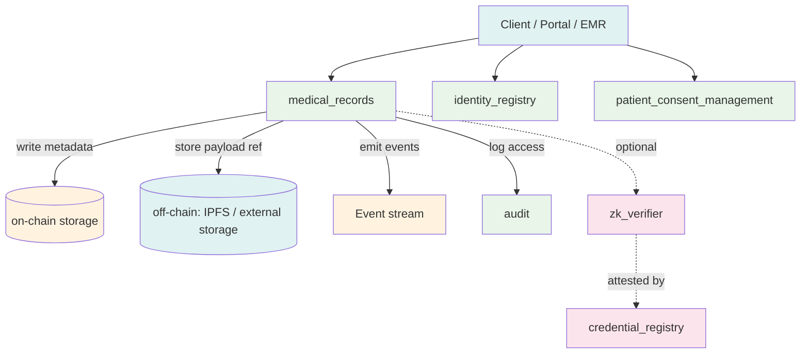

### Treasury governance execution (token transfer)

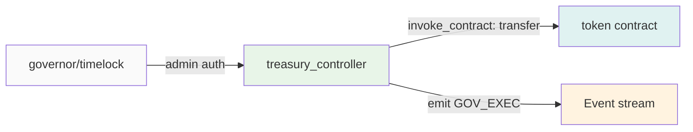

## 2) Call sequence diagrams

### Consent-gated record read (provider)

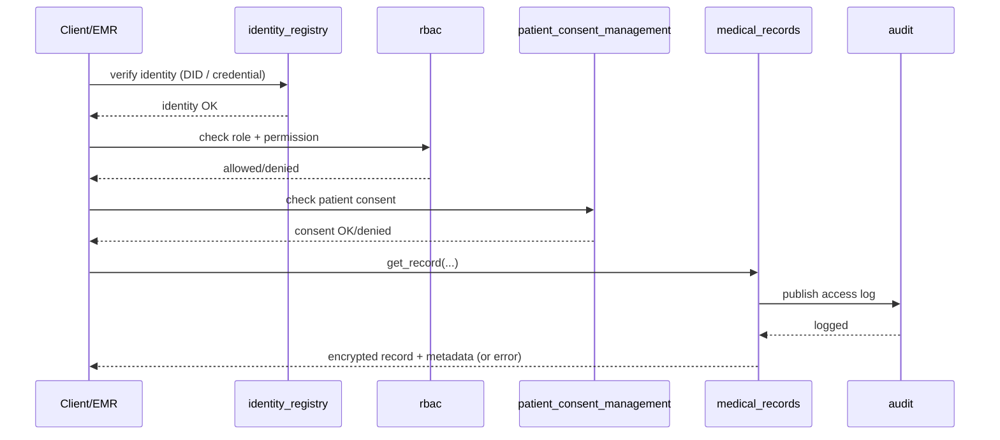

### ZK attestation gating (tests demonstrate multi-contract setup)

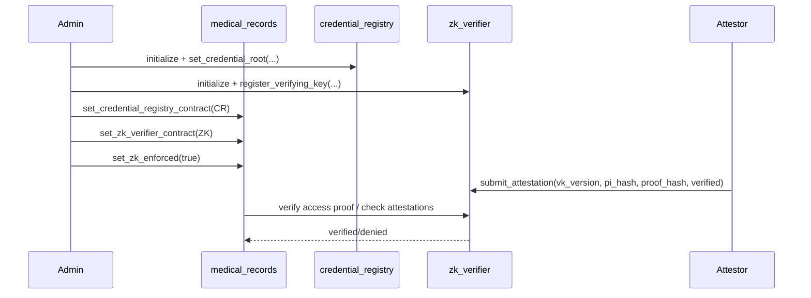

## 3) State machine diagrams

### Consent grant lifecycle (high level)

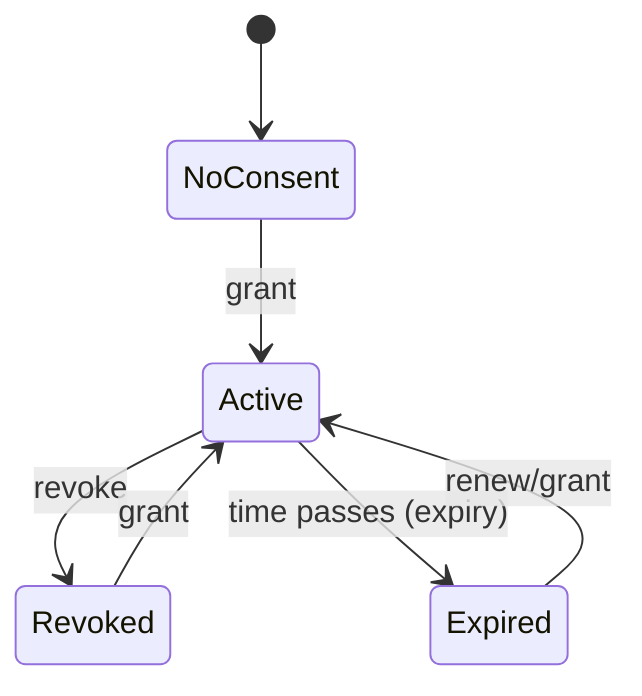

### Treasury proposal execution (conceptual)

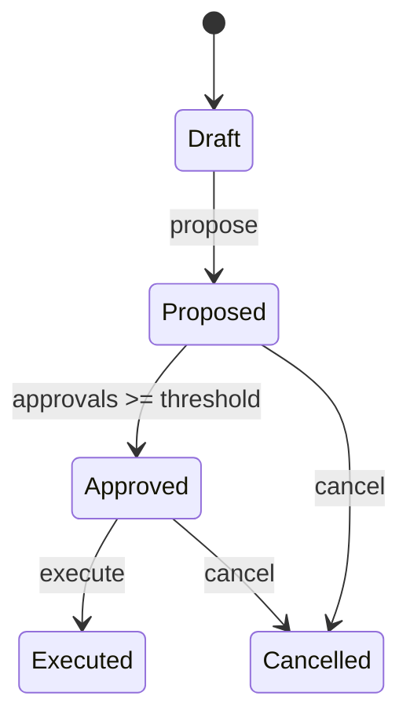

## 4) Permission inheritance diagrams

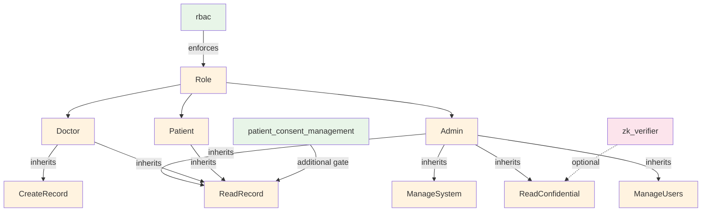

## 5) Message flow diagrams

### Event emission and off-chain consumers

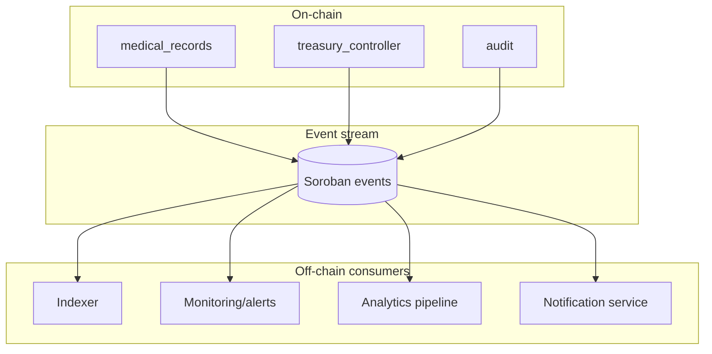

## Update process (how to keep diagrams correct)

When changing contract behavior or cross-contract wiring:

1. **Update code/tests first**
2. **Update diagrams** in `docs/CONTRACT_INTERACTIONS.md` and/or the specific subsystem doc
3. **Confirm diagram renders** locally (Mermaid preview)
4. **Link new diagrams** from `docs/DIAGRAMS_INDEX.md`
5. If you changed event topics/payloads, also run `npm run events:validate`

---

## 6) Cross-Contract Interaction Matrix

The matrix below lists every known contract-to-contract call in the system. Each row is a **caller**, each column is a **callee**. The cell value describes the purpose of the call.

| Caller → Callee | `identity_registry` | `rbac` | `patient_consent_management` | `medical_records` | `audit` | `zk_verifier` | `credential_registry` | `governor` | `timelock` | `upgrade_manager` | `treasury_controller` | `healthcare_payment` | `payment_router` | `escrow` | `cross_chain_bridge` |
|---|---|---|---|---|---|---|---|---|---|---|---|---|---|---|---|
| **`medical_records`** | verify identity | check role & permission | check patient consent | — | log record access | optional ZK proof gate | — | — | — | — | — | — | — | — | sync record hash |
| **`audit`** | — | — | — | — | — | — | — | — | — | — | — | — | — | — | — |
| **`patient_consent_management`** | verify patient DID | check caller role | — | — | log consent change | — | — | — | — | — | — | — | — | — | — |
| **`governor`** | — | — | — | — | — | — | — | — | queue proposal | — | — | — | — | — | — |
| **`timelock`** | — | — | — | — | — | — | — | confirm execution | — | execute upgrade | execute treasury tx | — | — | — | — |
| **`upgrade_manager`** | — | check admin role | — | — | log upgrade event | — | — | — | — | — | — | — | — | — | — |
| **`treasury_controller`** | — | check admin role | — | — | log treasury action | — | — | — | — | — | — | invoke token transfer | — | release escrow | — |
| **`healthcare_payment`** | verify payer identity | check payer role | check payment consent | — | log payment event | — | — | — | — | — | — | — | route payment | lock escrow | — |
| **`appointment_booking_escrow`** | — | check provider role | check appointment consent | — | log booking event | — | — | — | — | — | — | route refund | — | — | — |
| **`cross_chain_bridge`** | verify cross-chain DID | check bridge role | — | read/write synced records | log sync event | — | — | — | — | — | — | — | — | — | — |
| **`regional_node_manager`** | — | check node role | — | — | log node event | — | — | — | — | — | — | — | — | — | sync region data |
| **`mfa`** | verify identity | check MFA role | — | — | — | — | verify MFA credential | — | — | — | — | — | — | — | — |

> Empty cells indicate no direct on-chain call relationship. Off-chain consumers (indexers, monitoring) interact only via emitted events, not contract-to-contract calls.

---

## 7) Additional Sequence Diagrams for Common Healthcare Workflows

### Patient Registration and Identity Setup

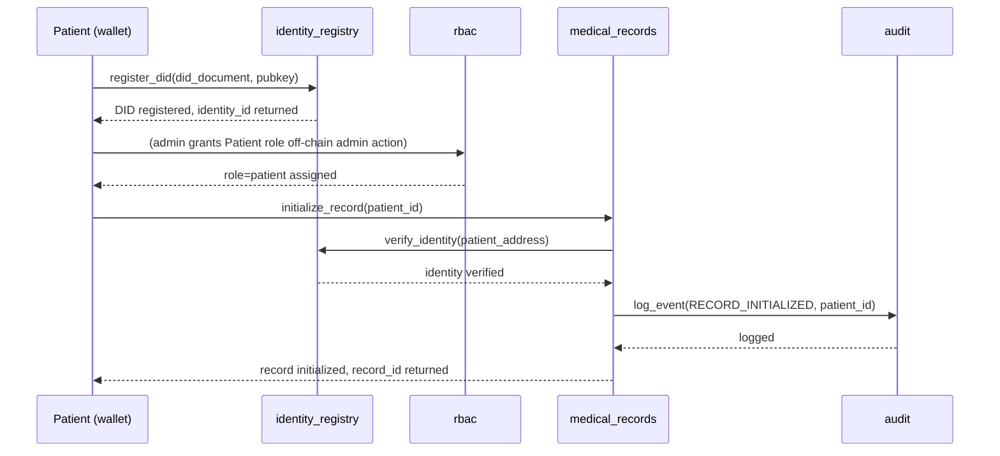

### Doctor Writes a Medical Record (Full Flow)

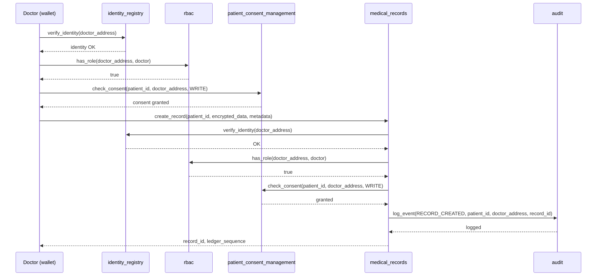

### Patient Revokes Doctor Access

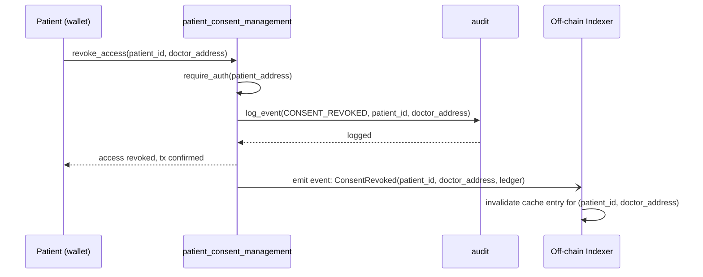

### Healthcare Payment Processing

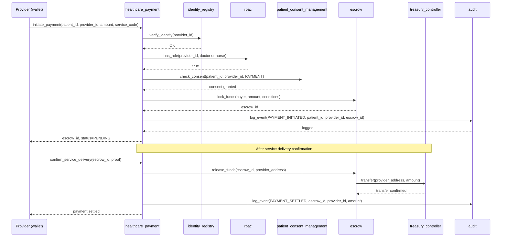

### Contract Upgrade via Governance

```mermaid
sequenceDiagram
    participant GC as Governance Council
    participant GOV as governor
    participant TL as timelock
    participant UM as upgrade_manager
    participant AUD as audit

    GC->>GOV: propose(calldata=[upgrade_manager.upgrade(new_wasm_hash)], description_hash)
    GOV-->>GC: proposal_id, state=Created

    Note over GOV: 24h voting delay passes

    GC->>GOV: cast_vote(proposal_id, YES, weight)
    Note over GOV: 72h voting window; quorum and approval threshold met
    GOV->>GOV: state → Succeeded

    GOV->>TL: queue(proposal_id, calldata, eta=now+48h)
    TL-->>GOV: queued

    Note over TL: 48h timelock elapses

    GC->>TL: execute(proposal_id)
    TL->>UM: upgrade(new_wasm_hash)
    UM->>RB: has_role(timelock_address, admin)
    RB-->>UM: true
    UM->>AUD: log_event(CONTRACT_UPGRADED, old_hash, new_wasm_hash)
    UM-->>TL: upgrade complete
    TL-->>GC: execution confirmed, state=Executed
```

### Cross-Chain Record Synchronization

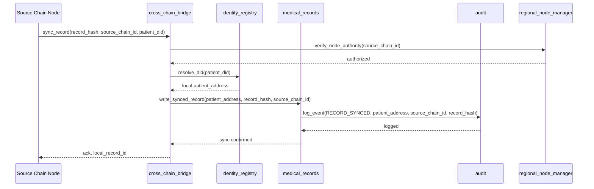

### Error Handling in Cross-Contract Calls

All cross-contract calls follow a consistent error propagation pattern:

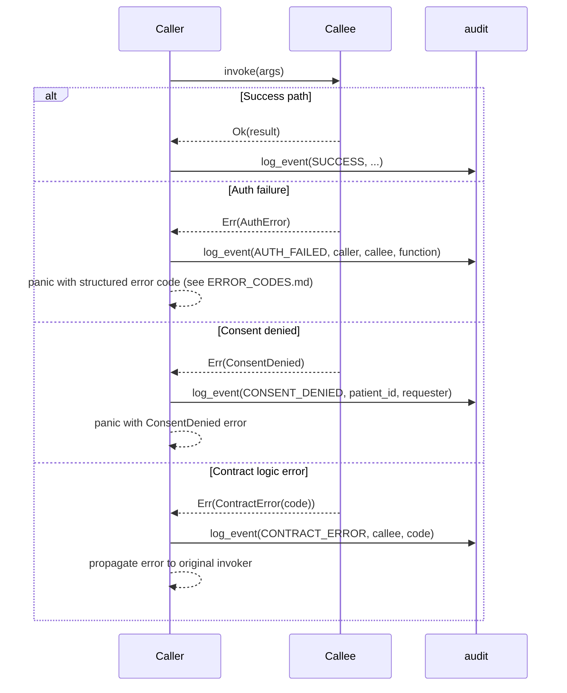

**Error handling rules:**
- Every cross-contract call must be wrapped in a result check — panicking on unexpected `Ok` is not acceptable.
- Auth errors and consent denials must always be logged to the `audit` contract before propagating.
- Callers must not silently swallow errors — if a downstream call fails, the entire transaction must fail (atomicity).
- Error codes are defined in [`docs/ERROR_CODES.md`](./ERROR_CODES.md).

