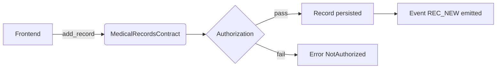

# Uzima Contracts Developer Guide

Comprehensive guidance for developers building, integrating, deploying, and maintaining Uzima smart contracts.

## Table of Contents
1. [API Reference](#api-reference)
2. [Frontend Integration Examples](#frontend-integration-examples)
3. [Deployment Guides](#deployment-guides)
4. [Troubleshooting](#troubleshooting)
5. [Best Practices & Patterns](#best-practices--patterns)
6. [Diagrams & Visual Aids](#diagrams--visual-aids)
7. [Cross-references](#cross-references)
8. [Maintenance & Updates](#maintenance--updates)

---

## 1. API Reference

### 1.1 Contracts and modules
- `contracts/medical_records`: core medical records contract
- `contracts/identity_registry`: identity management
- `contracts/zk_verifier`: zero-knowledge proof verification

### 1.2 Key public functions in `MedicalRecordsContract`
- `initialize(env, admin)`
- `manage_user(env, caller, user, role)`
- `add_record(env, caller, patient, diagnosis, treatment, is_confidential, tags, category, treatment_type, data_ref)`
- `get_record(env, caller, record_id)`
- `set_zk_enforced(env, caller, enforced)`
- `submit_zk_access_proof(env, caller, record_id, purpose, public_inputs, proof)`

### 1.3 Error codes
See `contracts/medical_records/src/errors.rs` for full enumeration:
- `Error::NotAuthorized`
- `Error::ContractPaused`
- `Error::InvalidCredential`
- `Error::RecordNotFound`
- `Error::RateLimitExceeded`
- `Error::EncryptionRequired`

### 1.4 Rate limiting and guards
- `set_rate_limit_config`
- `check_and_update_rate_limit`
- `require_initialized`
- `require_not_paused`

---

## 2. Frontend Integration Examples

### 2.1 JavaScript + Soroban SDK (recommended)

```js
import { SorobanClient, Address, Contract } from '@soroban-client/sdk';

const server = new SorobanClient.Server('https://soroban-testnet.stellar.org:443');
const contractId = '<CONTRACT_ID>';
const admin = Address.random();

// Example: initialization and adding a record
await server.invokeContract({
  contractId,
  functionName: 'initialize',
  args: [admin]
});

await server.invokeContract({
  contractId,
  functionName: 'manage_user',
  args: [admin, doctor, 'Doctor']
});

await server.invokeContract({
  contractId,
  functionName: 'add_record',
  args: [doctor, patient, 'Flu', 'Rest', false, ['respiratory'], 'Modern', 'Medication', 'Qm...']
});
```

### 2.2 Handling permission errors in UI
- If response contains `Error::NotAuthorized`, show context-specific message
- For `Error::InvalidCredential`, suggest `zk` workflow path

---

## 3. Deployment Guides

### 3.1 Local development (Soroban Localnet)

1. `make start-local`
2. `soroban network add local --rpc-url http://localhost:8000/soroban/rpc --network-passphrase "Standalone Network ; February 2017"`
3. `cargo build --all-targets`
4. `soroban contract deploy --wasm ./target/wasm32-unknown-unknown/release/medical_records.wasm --network local`

### 3.2 Testnet and Futurenet
- Use configured `.soroban-cli` profile
- Run `make deploy-testnet` / `make deploy-futurenet`
- Validate with an `invoke` health check

### 3.3 Upgrade path
- `soroban contract update --network local --contract-id <ID> --wasm <new.wasm>`
- Ensure `upgradeability` module admin permissions are correct

---

## 4. Troubleshooting

### 4.1 Fast fail patterns
- `Error::ContractPaused`: unpause with admin call
- `Error::NotAuthorized`: verify that user role is in `UserProfile` and active
- `Error::RecordNotFound`: validate recordId and record creation path

### 4.2 Audit and logs
- `get_patient_access_logs`, `get_crypto_audit_logs`
- `events::emit_*` are emitted for sensitive flows

### 4.3 Common pitfalls
- Missing `caller.require_auth()` in frontend auth wrapper
- Missing `mock_all_auths()` in tests causes nonexistent permission errors
- ZK gateway requires `set_zk_enforced(true)` + `submit_zk_access_proof` before `get_record`

---

## 5. Best Practices & Patterns

- Always use admin guards for management operations.
- Keep `data_ref` within allowed bounds (10-200 chars) using validation helpers.
- Use immutable record IDs and versioned metadata (history entries) when updating.
- Use `set_rate_limit_config` to avoid DoS via hot accounts.
- Use `grant_emergency_access` for auditable emergency workflows.

---

## 6. Diagrams & Visual Aids

### 6.1 Contract call flow (Mermaid)



### 6.2 Data model overview
- `MedicalRecord` contains patient, doctor, tags, confidentiality, category, data_ref
- `UserProfile` stores role + active status
- `ZkAccessGrant` stores zk session token metadata

---

## 7. Cross-references
- [API and architecture](./README.md)
- [Smart contract upgradeability](./upgradeability.md)
- [Regulatory compliance](./REGULATORY_COMPLIANCE.md)
- Existing tests:
  - [`contracts/medical_records/tests/integration/mod.rs`](../contracts/medical_records/tests/integration/mod.rs)
  - [`contracts/medical_records/src/test.rs`](../contracts/medical_records/src/test.rs)

---

## 8. Maintenance & Updates

- Add feature docs into this file as guarded sections.
- Update `docs/DEVELOPER_GUIDE.md` when adding new contract entrypoints.
- Validate code examples by running:
  - `cargo test --package medical_records --test integration`
  - `cargo test --package medical_records --all-targets`
- CI should fail on stale docs if new operation isn’t documented.

> Goal: keep docs current with release process (`module version` → `docs update`).
