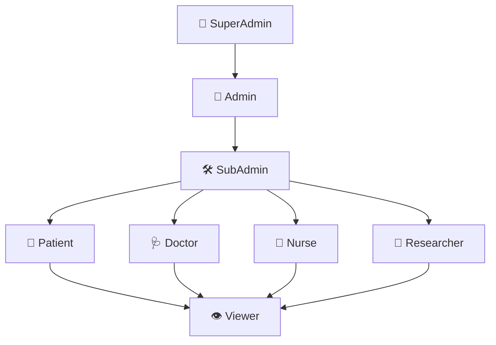

# Role-Based Access Control (RBAC) — Uzima Contracts

## Role Hierarchy

The Uzima platform uses a layered role hierarchy designed for healthcare environments. Higher-level roles inherit the permissions of all roles below them in their branch.



### Role Descriptions

| Role | Description |
|------|-------------|
| **SuperAdmin** | Platform root — can perform all operations including contract upgrades and emergency pauses |
| **Admin** | Organization-level administrator — manages users, roles, and policies within a healthcare org |
| **SubAdmin** | Department manager — can delegate roles at or below their own level within a department |
| **Doctor** | Licensed physician — can create, read, and annotate patient records they are consented for |
| **Nurse** | Clinical nurse — can read and add observations to records; cannot create primary records |
| **Researcher** | Approved researcher — can read de-identified/anonymized records with patient consent |
| **Patient** | Record owner — controls who accesses their records; can read their own full records |
| **Viewer** | Read-only access — can view records that have been explicitly shared with them |

## Permission Matrix

The following matrix lists every contract function and the minimum role required to invoke it. A ✓ indicates the role (or any role above it in the hierarchy) may call the function.

| Function | SuperAdmin | Admin | SubAdmin | Doctor | Nurse | Researcher | Patient | Viewer |
|----------|:---:|:---:|:---:|:---:|:---:|:---:|:---:|:---:|
| `initialize(admin)` | ✓ | | | | | | | |
| `pause_contract()` | ✓ | | | | | | | |
| `upgrade_contract()` | ✓ | | | | | | | |
| `grant_role(granter, grantee, role)` | ✓ | ✓ | ✓¹ | | | | | |
| `revoke_role(revoker, target, role)` | ✓ | ✓ | ✓¹ | | | | | |
| `has_role(address, role)` | ✓ | ✓ | ✓ | ✓ | ✓ | ✓ | ✓ | ✓ |
| `create_record(patient, data)` | ✓ | ✓ | ✓ | ✓ | | | | |
| `read_record(patient, record_id)` | ✓ | ✓ | ✓ | ✓² | ✓² | ✓³ | ✓⁴ | ✓⁴ |
| `update_record(patient, record_id, data)` | ✓ | ✓ | ✓ | ✓² | | | | |
| `add_observation(patient, record_id, obs)` | ✓ | ✓ | ✓ | ✓² | ✓² | | | |
| `grant_access(patient, provider)` | ✓ | | | | | | ✓ | |
| `revoke_access(patient, provider)` | ✓ | ✓ | | | | | ✓ | |
| `read_anonymized_record()` | ✓ | ✓ | ✓ | ✓ | ✓ | ✓ | | |
| `view_audit_log(patient)` | ✓ | ✓ | ✓ | | | | ✓ | |
| `register_patient(patient_id, pubkey)` | ✓ | ✓ | ✓ | | | | | |
| `register_provider(provider_id, pubkey)` | ✓ | ✓ | | | | | | |

> ¹ SubAdmin may only grant/revoke roles strictly below SubAdmin (Doctor, Nurse, Researcher, Patient, Viewer).  
> ² Requires active patient consent on-chain (`patient_consent_management` contract).  
> ³ Researcher access requires consent and data must be de-identified per policy.  
> ⁴ Patient/Viewer can only read records explicitly shared with their address.

## Rules

- **Delegation**: A role holder can only grant roles at or below their own level.
  An `admin` can grant `sub_admin` or `viewer`. A `sub_admin` can grant `viewer` only.
- **Revocation**: Revoking a role is immediate and cascades to all roles that were
  delegated downstream from the revoked role.
- **No self-escalation**: No address can grant itself or others a role above its
  current permission level.

## Contract Functions

| Function | Required Role | Description |
|---|---|---|
| `initialize(admin)` | — | Sets the initial admin at deployment |
| `grant_role(granter, grantee, role)` | admin or sub_admin (within hierarchy) | Delegates a role |
| `revoke_role(revoker, target, role)` | Parent role holder | Revokes a role and cascades |
| `has_role(address, role)` | — | Read-only role check |

## Role Assignment Examples

### Assigning a Doctor to a Patient's Care Team

```bash
# Admin grants Doctor role to a provider address
soroban contract invoke --id $CONTRACT_ID --network testnet \
  -- grant_role \
  --granter GADMIN_ADDRESS \
  --grantee GDOCTOR_ADDRESS \
  --role doctor

# Patient grants consent to that doctor (required separately)
soroban contract invoke --id $CONSENT_CONTRACT_ID --network testnet \
  -- grant_access \
  --patient GPATIENT_ADDRESS \
  --provider GDOCTOR_ADDRESS
```

### Granting Researcher Read Access (De-identified)

```bash
# SubAdmin grants Researcher role
soroban contract invoke --id $CONTRACT_ID --network testnet \
  -- grant_role \
  --granter GSUBADMIN_ADDRESS \
  --grantee GRESEARCHER_ADDRESS \
  --role researcher

# Researcher reads anonymized data (no patient consent required)
soroban contract invoke --id $CONTRACT_ID --network testnet \
  -- read_anonymized_record \
  --record_id "REC-2025-001"
```

### Revoking Access on Staff Departure

```bash
# Admin revokes SubAdmin's role — cascades to any roles they delegated
soroban contract invoke --id $CONTRACT_ID --network testnet \
  -- revoke_role \
  --revoker GADMIN_ADDRESS \
  --target GSUBADMIN_ADDRESS \
  --role sub_admin
# All roles granted downstream by this SubAdmin are also revoked automatically
```

## Adding a New Role

1. Add the role symbol to the contract constants
2. Insert it into the hierarchy map
3. Add tests to `delegation_tests.rs`
4. Update this document and the Permission Matrix above